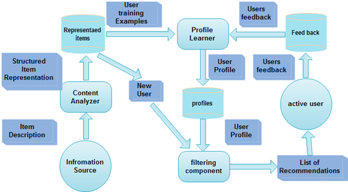
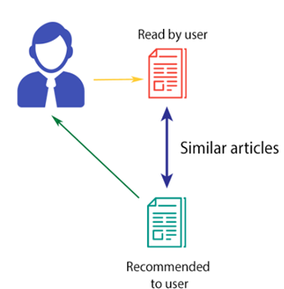
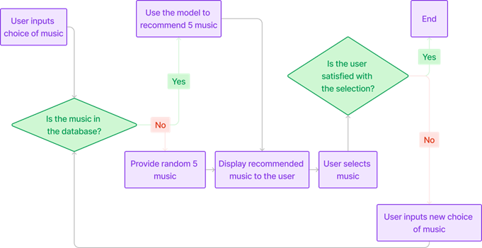

# MeloMix
The MeloMix website is a music recommendation system that utilizes Cosine Similarity and t-SNE for dimensionality reduction to suggest songs to users based on their preferences.

## Problem Statement
As the volume of music data continues to grow, traditional recommendation methods face significant challenges in delivering meaningful and diverse suggestions. These conventional approaches, often based on collaborative filtering or simple content-based filtering, may not adequately capture the complexities of the modern music landscape. They can lead to issues such as "filter bubbles," where users are repeatedly exposed to similar content, resulting in a lack of diversity in recommendations.

## About the Recommendation System
In this project the recommendation system used is “Content-based system.” The system utilizes features from the music tracks, such as genre, energy, acoustic-ness, etc., to calculate similarity between songs. This characteristic is typical of content-based systems, which focus on the attributes of the items themselves (in this case, the songs) to make recommendations.

 

## Architecture and Design
The architecture of website is designed to recommend songs based on user input and involves multiple components for data handling, processing, and recommendation. The core of the architecture is the recommendation engine, which takes user input (a song name) and checks if it's in the existing database. If the song is found, the engine calculates song similarities using cosine similarity, measuring the likeness between different tracks based on various features like genre, tempo, and energy.

For songs that are in the database, the engine recommends five similar tracks. It does this by finding songs with the highest cosine similarity, sorted by additional factors like popularity. For songs not found in the database, the engine randomly selects five songs to suggest to the user.

